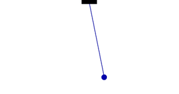
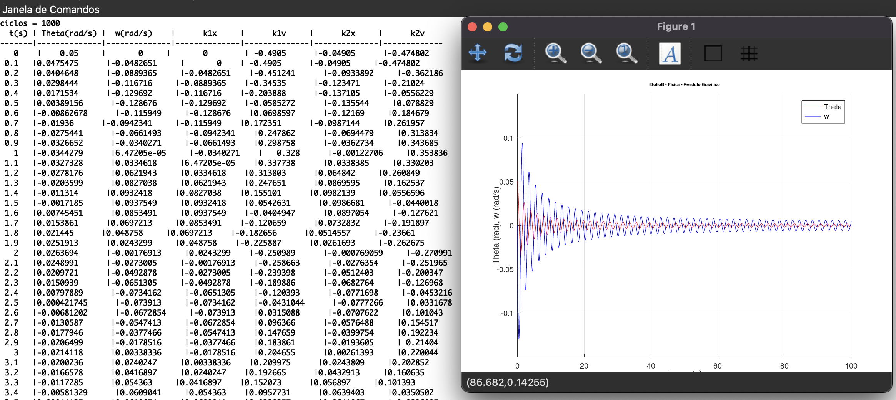

<h1 align="center">
    
</h1>

Grafico sobre Pêndulo Gravítico

    

📌 Minha pagina do Pêndulo Gravítico
------------------
EfolioB de Física Geral, programa que simula o grafico do movimento de um Pêndulo, baseando numa formula para angulos pequenos, o metodo aplicado foi o Huen.
Este programa simula o movimento de um pêndulo amortecido usando o método de Heun. O método de Heun é um método numérico usado para resolver equações diferenciais ordinárias e é usado aqui para aproximar a posição e a velocidade do pêndulo ao longo do tempo.

O programa primeiro define várias variáveis, incluindo a massa e o comprimento do pêndulo, a densidade do ar e o coeficiente de arrasto. Esses valores são usados para calcular as equações de movimento do pêndulo. Ele também define as condições iniciais para o ângulo e a velocidade angular do pêndulo.
O programa utiliza um loop while para percorrer as etapas de tempo e atualizar a posição e a velocidade do pêndulo usando o método de Heun. Ele estima o valor do ângulo e da velocidade angular no ponto médio do intervalo de tempo e usa isso para corrigir as estimativas, o que leva a uma solução mais precisa.
O programa não usa nenhuma biblioteca específica para plotar os resultados, mas usa o comando básico 'printf' do Octave para imprimir o ângulo e a velocidade angular em cada intervalo de tempo. Desta forma podemos copiar os resultados e utilizá-los em outra ferramenta para plotar os resultados.

O pêndulo gravítico tem um movimento harmónico simples quando todas as forças resistentes não, são consideradas.
Quando as forças resistentes, como a resistência do ar, são apreciáveis então verifica-se uma diminuição exponencial da amplitude e da velocidade angular ao longo do tempo.
Pela análise do gráfico obtido verifica-se que ocorre um amortecimento gradual da amplitude e da velocidade angular devido à resistência do ar. 
 

🔧 Tecnologias utilizadas:
------------------

- <strong>Octave</strong>
- <strong>MacOS</strong>

Para instalar Octave: https://wiki.octave.org/Octave_for_macOS
💬 Fale comigo
------------------
[*Entre em contato comigo*](https://www.linkedin.com/in/ivo-baptista-3712144/)

